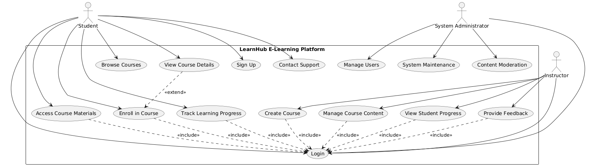

# Proyek Platform E-Learning

## Deskripsi Proyek
Ini adalah template website responsif untuk platform e-learning, menampilkan desain modern dengan latar belakang partikel dinamis. Website ini dirancang untuk menampilkan kursus dan konten pendidikan dengan cara yang menarik.

## Sumber & Inspirasi Template
Template ini didesain khusus tetapi terinspirasi oleh:
- [Template Pendidikan Colorlib](https://colorlib.com/wp/cat/education/)
- [Template Pendidikan Bootstrap](https://themewagon.com/themes/free-bootstrap-4-html5-educational-website-template-academics/)
- Latar belakang dinamis oleh [Particles.js](https://vincentgarreau.com/particles.js/)

## Struktur & Penjelasan Proyek

### HTML (index.html)
File HTML berisi struktur website:
- `<head>`: Berisi metadata, judul, dan tautan ke CSS dan font
- `<header>`: Bar navigasi dengan logo dan menu
- `<section id="home">`: Bagian hero dengan tombol ajakan bertindak
- `<section id="courses">`: Menampilkan kursus unggulan dalam tata letak grid
- `<footer>`: Informasi kontak dan tautan cepat

### CSS (styles.css)
File CSS menangani semua aspek styling:
- Variabel root untuk warna dan gaya yang konsisten
- Desain responsif menggunakan media queries
- Animasi untuk elemen interaktif
- Tata letak menggunakan Flexbox dan Grid
- Styling untuk header, bagian hero, kursus, dan footer

### JavaScript (script.js)
File JavaScript menambahkan fungsionalitas interaktif:
- Tombol menu untuk perangkat mobile
- Scrolling halus untuk tautan navigasi
- Penandaan menu aktif berdasarkan posisi scroll
- Efek scroll pada header
- Latar belakang dinamis dengan library particles.js

## Fitur
- Desain responsif yang berfungsi di semua perangkat
- Latar belakang interaktif dinamis menggunakan particles.js
- Antarmuka modern dan bersih dengan animasi
- Navigasi sederhana dengan penandaan bagian aktif
- Kartu kursus dengan efek hover

## Topik Web
Website ini dirancang dengan tema Platform E-Learning yang menawarkan berbagai kursus online. Desainnya menekankan:
- Kemudahan akses materi pembelajaran
- Representasi visual dari konten kursus
- Navigasi yang jelas dan alur pengguna yang intuitif
- Estetika yang profesional namun menarik

## Struktur Menu
Menu sederhana ini mencakup:
- Beranda: Halaman utama dengan bagian pengenalan
- Kursus: Konten pendidikan yang tersedia
- Instruktur: Informasi mengenai pengajar
- Sumber Daya: Materi pembelajaran tambahan
- Tentang Kami: Informasi mengenai platform

## Use Case Diagram
Berikut adalah diagram use case untuk aplikasi LearnHub:

Dengan ukuran kustom:

Untuk melihat diagram use case secara interaktif, buka file `learnhub_use_case_diagram.html` di browser.